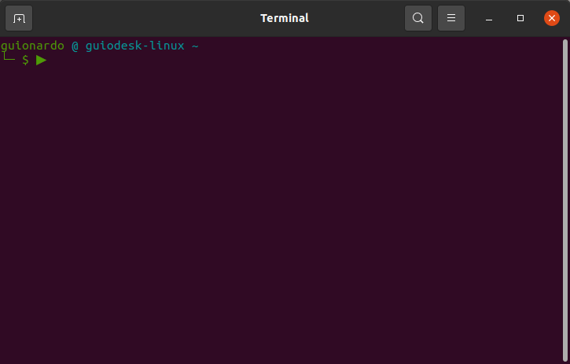

# guiosoft-scripts

Automation scripts for every day

[](https://github.com/guionardo/guiosoft-scripts/actions/workflows/codeql-analysis.yml)
[](https://github.com/guionardo/guiosoft-scripts/actions/workflows/shell.yml)
[](https://github.com/guionardo/guiosoft-scripts/actions/workflows/new_release.yml)

## Generic updater

Add this aliases to your .bashrc (or equivalent)

```
alias update="curl -s https://raw.githubusercontent.com/guionardo/guiosoft-scripts/main/install.sh | sudo bash -s"
alias sudo="sudo "
```

You can run this:

```bash
update vscode
```


## Install (update) golang (for debian, ubuntu, etc)

```bash
bash <(curl -s https://raw.githubusercontent.com/guionardo/guiosoft-scripts/main/install_golang.sh)
```



## Install vscode

```bash
bash <(curl -s https://raw.githubusercontent.com/guionardo/guiosoft-scripts/main/install_vscode.sh)
```

## Install dbeaver

```bash
bash <(curl -s https://raw.githubusercontent.com/guionardo/guiosoft-scripts/main/install_dbeaver.sh)
```

## Setup console

In development

[README](terminal_setup/README.md)

## Software Versions

| Name | Version | Date | Release |
|------|---------|------|---------|
| vscode | 1.92.2 | 2024-08-15 | [July 2024 Recovery 2](https://code.visualstudio.com/sha/download?build=stable&os=linux-deb-x64) |
| dbeaver | 24.1.5 | 2024-08-18 | [24.1.5](https://dbeaver.io/files/dbeaver-ce_latest_amd64.deb) |
| golang | 1.23.0 | 2024-09-01 | [1.23.0](https://golang.org/dl/go1.23.0.linux-amd64.tar.gz) |

[versions.json updated @ 2024-09-01 12:51:30.066946](versions.json)


## Testing branch